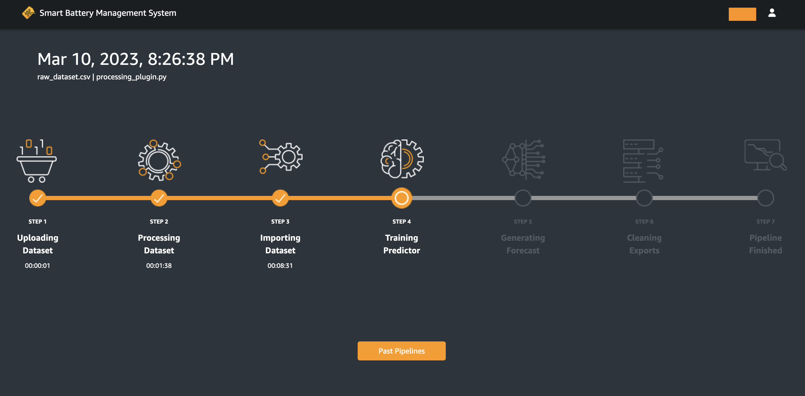

## Guidance for Electric Vehicle (EV) Battery Health Prediction on AWS

### Introduction 

EV batteries, predominately lithium-ion (Li-ion) batteries, have been the bottleneck for scaling EVs, which are crucial to a net-zero economy. One challenge in the EV battery ecosystem is insufficient and inaccurate battery state of health (SOH) and remaining useful life (RUL) monitoring and prediction, resulting in shortened battery lifespan, driver frustration, lack of visibility for end-of-life processing, and wasted critical materials. Instead of the conventional static rule-of-thumb formulas, this Guidance showcases how customers can leverage the AI/ML capabilities on AWS to easily predict SOH and RUL. Better monitoring and more accurate prediction can help customers extend battery lifespan, improve driver satisfaction, reduce material waste and supply chain risks, and drive towards a sustainable future for mobility.

The sample code in this project is based on the Guidance for Electric Vehicle (EV) Battery Health Prediction on AWS. It deploys an event-driven ML pipeline for EV Battery health prediction. To simulate the data ingestion and consumption portions of the [Connected Mobility Platform](https://docs.aws.amazon.com/architecture-diagrams/latest/connected-mobility-platform-on-aws/connected-mobility-platform-on-aws.html), we build a web application, which allows you to upload battery health data and processing plugin files (scripts to clean up data). The front-end UI also acts as a digital twin for batteries, displaying battery health status and prediction results.

### Architecture

Here is the reference architecture for this project:


## Getting Started

### Requirements

* [Create an AWS account](https://portal.aws.amazon.com/gp/aws/developer/registration/index.html) if you do not already have one and log in. The IAM user that you use must have sufficient permissions to make necessary AWS service calls and manage AWS resources.
* [AWS CLI](https://docs.aws.amazon.com/cli/latest/userguide/install-cliv2.html) installed and configured
* [Git Installed](https://git-scm.com/book/en/v2/Getting-Started-Installing-Git)
* [Node and NPM](https://docs.npmjs.com/downloading-and-installing-node-js-and-npm) >= 14 installed
* [AWS Cloud Developer Kit](https://docs.aws.amazon.com/cdk/v2/guide/cli.html) installed and configured
* [Docker](https://www.docker.com/)
* [Python3](https://www.python.org/downloads/) >= 3.8


### Deploying the CDK stack

1. Create a new directory, navigate to that directory in a terminal and clone the GitHub repository:
    ``` 
    git clone https://github.com/aws-solutions-library-samples/guidance-for-electric-vehicle-battery-health-prediction-on-aws
    ```
2. Change directory to the pattern directory:
    ```
    cd source
    ```
3. Configure your AWS CLI to point to the AWS account and region where you want to deploy the solution. You can run the following command to verify which AWS account you are currently logged on:
    ```
    aws sts get-caller-identity
    ```
4. If you are using CDK to deploy to your AWS account for the first time, you will have to bootstrap your account. To do this, run the command:
    ```
    cdk bootstrap <account-number>/<region>
    ```
5. To build the entire project, run 
    ```
    npm run build
    ```
6. To deploy the project, run
    ```
    npm run deploy
    ```
7. We have architected this demo in a way that self-registration is disabled and only administrators can add users to access the web application. Therefore, once the project is deployed, you need to create a Cognito User to access the web application [through the AWS Management console](https://docs.aws.amazon.com/cognito/latest/developerguide/how-to-create-user-accounts.html) or [using AWS CLI](https://docs.aws.amazon.com/cli/latest/reference/cognito-idp/admin-create-user.html). 

8. You have finished deployment and setting up! You can find the URL of the web application in CloudFront, or as part of the CDK outputs (value for WebAppCloudFrontDistributionDomainName).

**Note**: Since WAF CloudFront ACL can only be installed in us-east-1, the WAF stack and App stack might be deployed to 2 separate regions, depending on what your default deployment region is.

### How it works

The sample code deploys a web application for 2 types of users: Developer and Fleet Operator. Developer has access to all parts of the application, and Fleet Operator can only view the dashboard with battery location and digital twin of batteries after at least one ML pipeline is executed successfully. You can switch profile by clicking the User icon and then the Switch Profile button.

After logging in, Developer can upload battery health datasets as well as processing plugin scripts. We provide a [sample battery dataset](./source/demo/raw_dataset.csv) and [sample processing plugin file](./source/demo/processing_plugin.py) for easy testing. The sample dataset is from [this project](https://data.matr.io/1/projects/5c48dd2bc625d700019f3204) by Severson et al. Data-driven prediction of battery cycle life before capacity degradation. Nature Energy volume 4, pages 383–391 (2019).


After files are uploaded, the ML pipeline gets triggered to start. Developer will see the progress of the ML pipeline. 



When the ML pipeline finishes (this can take a few hours), both Developer and Fleet Operator will see a map with batteries.


You can click on a vehicle to view battery information. To demonstrate how a digital twin for a battery could look like, we inserted some dummy values for the battery attributes, specifed [here](./source/deploy/assets/). In the Battery Health Prediction panel to the right, the line chart shows past and predicted battery state of health. You can click Play to watch actual data streaming as comparison to predicted data. State of Health, RUL, and model drift were all predicted or calculated using the ML pipeline deployed with the web application. 


Developer can view results from selected ML pipeline. They can click the User icon, navigate to Pipelines, select the desired pipeline, and click Connected Vehicles, which takes them to the dashboard with battery locations. For Fleet Operators, the predicted data they see are from the most recent pipeline.


## Security

See [CONTRIBUTING](CONTRIBUTING.md#security-issue-notifications) for more information.

## Cleanup
To clean up all resources, you can run `npm run destroy`.

## License

This library is licensed under the MIT-0 License. See the LICENSE file.

## Disclaimer
You should not use this AWS Content in your production accounts, or on production or other critical data.  You are responsible for testing, securing, and optimizing the AWS Content, such as sample code, as appropriate for production grade use based on your specific quality control practices and standards.